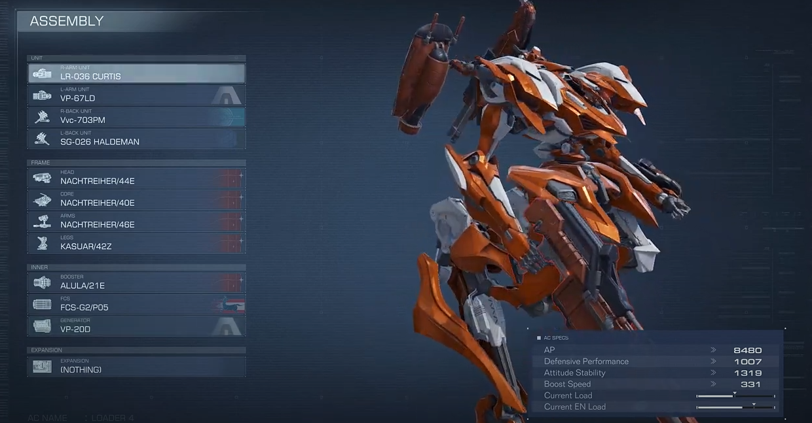
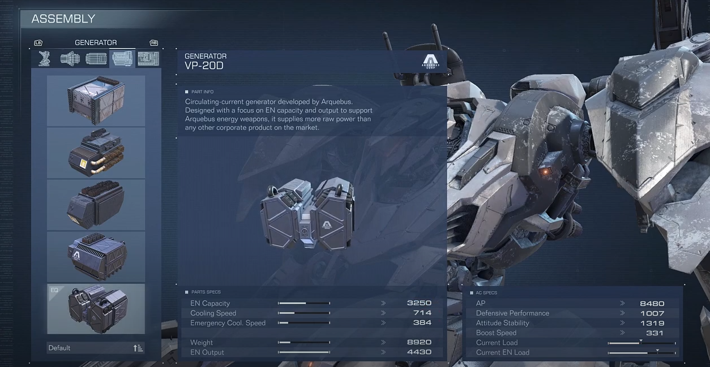

# PARTS

## Units (Weapons)
- R-Arm Unit
- L-Arm Unit
- R-Back Unit
- L-Back Unit

## Frame - Required for All Frames
- Head
- Core
- Arms
- Legs

## Inner - Required for All Frames
- Booster
- FCS
- Generator

## Expansion
- Expansion

# SPECS

Each part has "Part Info" which is a description

## AC Specs (Accumlative Stats)
- AP (Armor Points/Health)
- Defensive Perfomance
- Attitude Stability
- Boost Speed
- Current Load (arrow is max amount of weight) <-- dependent on legs
- Current EN Load (arrow is max energy strain for a unit)

## Units Specs

### Arms
- Attack Power
- Impact
- Consecutive Hits (amount of rounds fired in a single shot)
- Weight
- EN Load

### Back
- Attack Power
- Impact
- Total Rounds
- Weight
- EN Load

## Frame Specs

### Head

### Arms
- AP
- Arms Load Limit
- Firearm Specialization
- Weight
- EN Load

### Legs
- AP
- Attitude Stability
- Load Limit
- Weight
- EN Load

## Inner Specs

### Booster

### FCS

### Generator
- EN Capacity
- Cooling Speed
- Emergency Cool. Speed
- Weight Output

## Expansion Specs

### Expansion

# References
[Initial Video Reference](https://youtu.be/BNXcEilgo8w)

